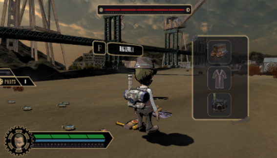

# Shutter Island
> '캡스톤 디자인'을 진행하며 개발한 4인 멀티게임입니다.

![][dbd-image]

`Dead By Daylight`는 게임 특유의 무서운 분위기로 인해 진입 장벽이 높고 생존자 행동에 제약이 많은 편입니다.

개발한 게임은 기존 게임의 플레이 방식을 따르지만, 반격과 아이템 인벤토리 등의 기능을 추가하여 새롭게 구현하였습니다.
* unity
* photon cloud
* game development

## 구현 내용
자세한 구현 내용은 플레이 영상을 확인해 주세요.

## 플레이 영상
[![][youtube-image]][play-url]

<!-- Markdown link & img dfn's -->
[dbd-image]: https://steamcdn-a.akamaihd.net/steam/apps/381210/header.jpg?t=1587510462
[youtube-image]: https://encrypted-tbn0.gstatic.com/images?q=tbn%3AANd9GcQ0W15QOoCkGdmGAT4yoszK-lomT0IYZmOkZ_m_cGhQJEoHyY-Z&usqp=CAU
[play-url]: https://youtu.be/zJ4DxAjeA8s
